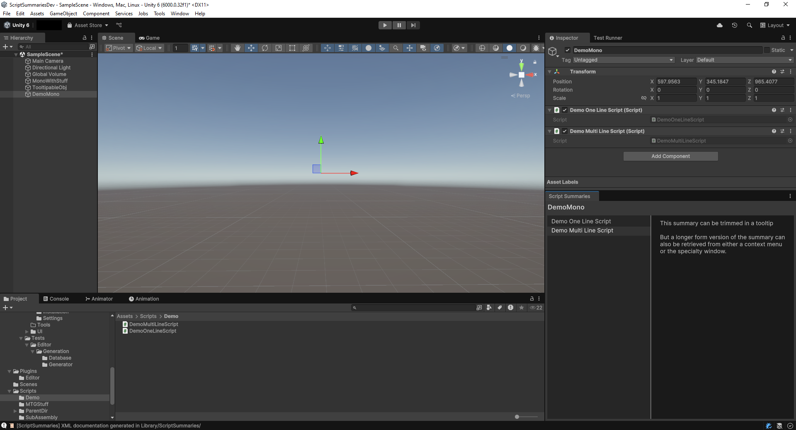

# About Script Summaries

Script Summaries retrieves the `
` text in your scripts and presents
that documentation in various spots in the editor.

The docs can be seen:

- As a [tooltip](./tooltip.md) in the Project Window
  

- In a [modal popup](./summary_popup.md)
  

- In a [contextual window](./summary_window.md) based on a selected MonoBehaviour
  

## Quick Start

Script Summaries takes a couple of steps to setup before summaries will display:

1. Install the package via Unity's Package manager with the gitURL `https://github.com/AnEmortalKid/com.snoutical.script-summaries.git`
1. [Install](./installing.md) the package's dependencies
2. [Settings](./settings.md) defining the directories we can read from

## Your Own Tools

A runtime API is provided so you can build your own tooling, for example,
building a custom inspector that shows the summary as a help message.

## Find out More

See everything available in [Table Of Contents](./table_of_contents.md)
