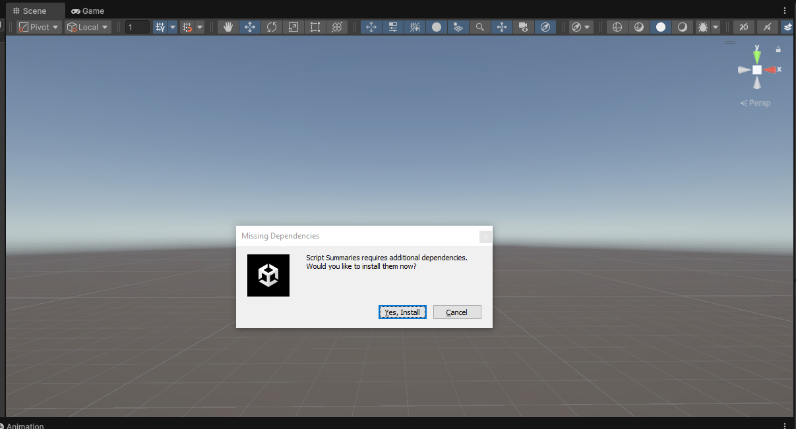
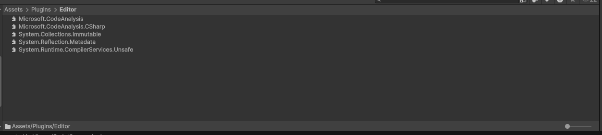
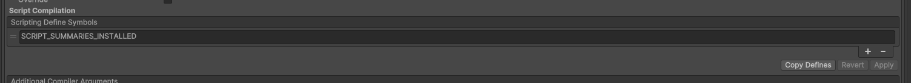
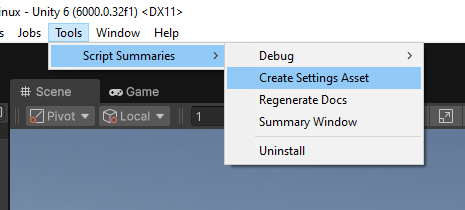

# Installing

Script Summaries requires some `Roslyn`.

The install process will automatically download the DLLs and place them in `Plugins/Editor`.
To initiate the process, simply install the package and wait for the popup to show up.

Once the installation is complete, you should see DLLs placed within your Project window.

The installation process will add a custom compiler define when the required DLLs exist.
This define controls whether the rest of the assemblies attempt to compile or not.

You can also verify the installation by checking the `Tools > Script Summaries` menu,
it should now contain more options.

With the install complete, you can now configure the [Settings](./settings.md) for the package.