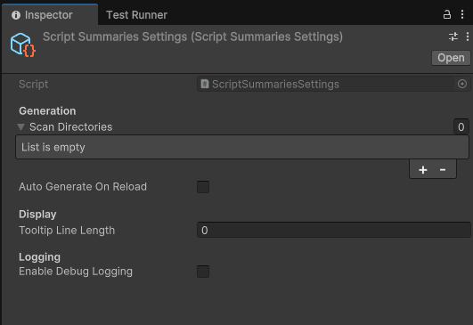

# Settings

Script Summary offers some controllable settings, these all live in a `ScriptSummariesSettings` scriptable object.

To create one, Use the `Tools > Script Summaries > Create Settings Asset`

## Settings Object

The asset controls:

- What to generate documentation for
- When to generate it
- How to display the summaries on the UI
- How much logging should be shown

## Options

### Generation

* **Scan Directories**
    * Defines what folders we should scan for `.cs` files and generate summaries for
    * If left empty, no documentation will be generated.
* **Auto Generate on Reload**
    * Determines whether docs should be regenerated when Unity detects an assembly reload or not
    * If left off, you can use the `Tools > Script Summaries > Regenerate Docs` menu to update your docs

### Display

* **Tooltip Line Length**
    * How many lines of summary to display on tooltips
    * Default of 0 shows all lines available

### Logging

* **Enable Debug Logging**
    * Whether logs should be produced as the tool runs
    * **Note:** some logs will display regardless of this setting due to their importance
