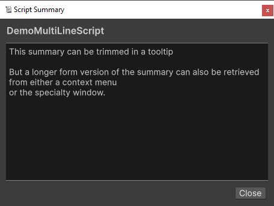
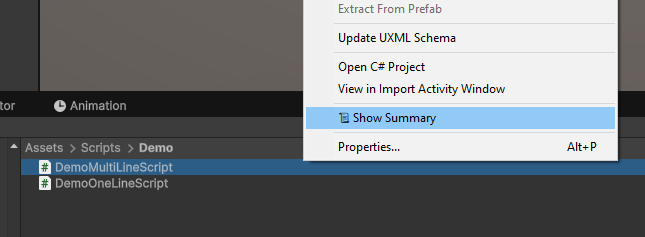
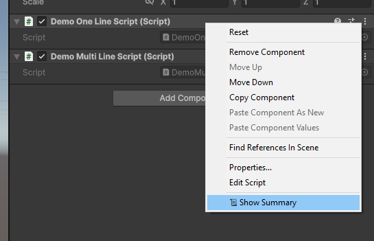

# Summary Popup

Script Summaries can show a `
` as a modal popup.

To show the popup, use the `📜 Show Summary` button accessible from either:

* The Project Window , conditionally available if documentation exists.

* The inspector context menu, always available even if there's no documentation. 

