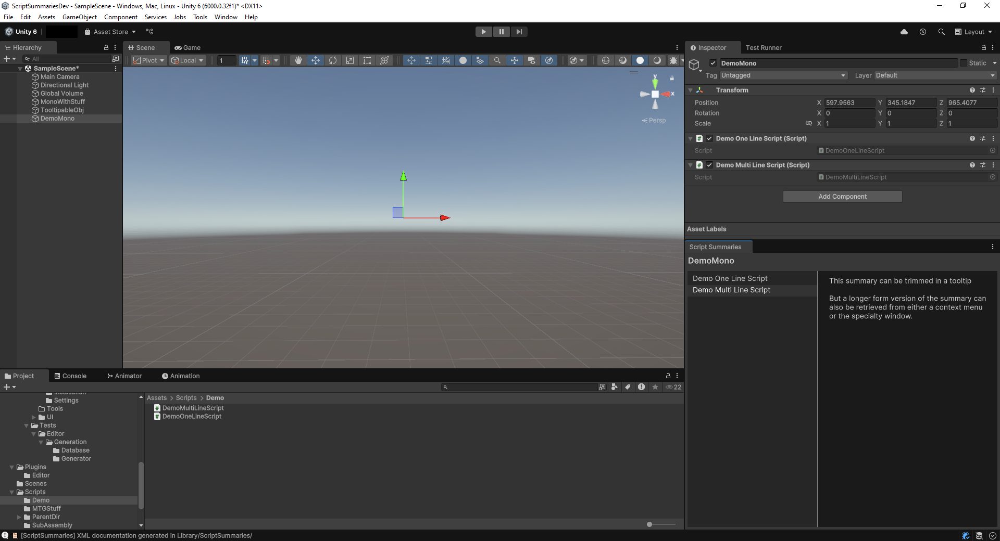
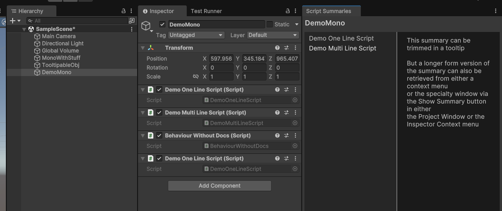

# Summary Window

Script Summaries offers a Window that can display summaries for all MonoBehaviours
that have documentation generated for them, based on the object currently selected.

The window only shows documentation for each script once, 
regardless of how many copies you have.

To access the Script Summaries Window, use `Tools > Script Summaries > Summary Window`.
