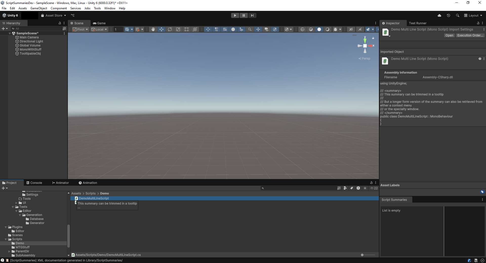

# Tooltips

Script Summaries can show a `
` as a tooltip in the Project Window,
when you hover over your scripts.

The `Tooltip Line Length` property of the [Settings](./settings.md)
gives you the option to control the length and trim longer lines.

